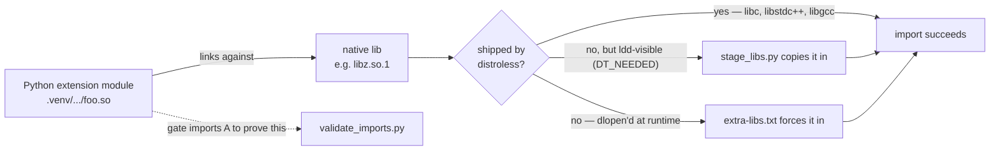

# Container images

The [`Dockerfile`](Dockerfile) is a single multi-stage build that produces
**two runtime images** from one shared `builder`. Pick a target with
`--target`; with no `--target` you get `hardened` (it is the last stage).

| Target           | Base                              | Use it for                         | Attack surface |
| ---------------- | --------------------------------- | ---------------------------------- | -------------- |
| `hardened`       | `gcr.io/distroless/cc-debian12`   | **production** (default)           | minimal        |
| `runtime-debian` | `debian:bookworm`                 | local iteration / debugging only   | full userland  |

```bash
# Production image (distroless). This is what docker-compose and CI build.
docker build -f docker/Dockerfile -t wertvoice-agent .

# Convenience image (full Debian userland, has a shell). NOT for production.
docker build -f docker/Dockerfile --target runtime-debian -t wertvoice-agent:debian .
```

Both run as the unprivileged uid `65532` (`nonroot`) and start the agent with
`python -m wertvoice_agent start`.

## Why two targets

`hardened` (distroless) ships **only** glibc, libgcc, libstdc++ and CA
certificates — no shell, no package manager, no `perl`/`ncurses`/`sqlite`. The
OS-level CVEs that a full distro drags in are simply *not present*, which is why
[`openvex.json`](../openvex.json) needs no OS suppressions, and there is no
`sh`/`apt`/`curl` for an attacker to pivot with after a hypothetical RCE. It
pairs with the runtime hardening in
[`docker-compose.yaml`](../docker-compose.yaml) (`read_only`, `cap_drop: ALL`,
`no-new-privileges`).

The price of a minimal base is that compiled wheels can no longer assume a full
system is present. `runtime-debian` is the escape hatch for local work: a full
userland means any system library a wheel might want is already there, at the
cost of the exact attack surface distroless removes. **Treat it as a conscious
convenience tradeoff, not a place to ship from.**

## How the distroless image gets its system libraries

distroless has no package manager, so anything a compiled wheel needs at
runtime must be copied in at build time. Before the mechanisms, the vocabulary
that makes them click.

### Two kinds of `.so`

"Shared object" covers two very different things, and the whole design hinges on
not conflating them:

- **Extension module** — a *Python* `.so` under `.venv/.../site-packages` (e.g.
  `numpy/.../_multiarray_umath…so`, `cryptography/.../_rust.abi3.so`). It has a
  `PyInit_` entry point; `import` loads it.
- **Native (system) library** — a plain C/C++ `.so` that an extension module
  *links against* (e.g. `libz.so.1`, `libavcodec…so`). It lives in `/usr/lib/…`,
  **not** in the venv, and distroless ships almost none of them.

An extension module imports successfully only if every native library it links
against is present in the image:



Three mechanisms cooperate — two **provide** native libraries, one **verifies**
the Python modules can actually use them:

| Mechanism | Operates on | Job |
| --- | --- | --- |
| `stage_libs.py` (automatic, via `ldd`) | native libs in the **eager** `DT_NEEDED` closure | copy in the system libs distroless lacks — no hand-editing |
| `extra-libs.txt` (manual) | native libs `dlopen`'d **lazily** at runtime (invisible to `ldd`) | force-stage the few auto-discovery cannot see |
| `validate_imports.py` (the gate) | the **Python extension modules** themselves | import every one to prove the libraries above satisfy them |

### Staging the libraries

The provisioning itself is two build stages:

1. **`lib-staging`** runs [`scripts/stage_libs.py`](../scripts/stage_libs.py),
   which `ldd`s every `.so` in the venv and managed interpreter to find the
   system libraries the wheels link against *eagerly* (their `DT_NEEDED`
   closure) and copies them under `/staging-libs`, mirroring their absolute
   paths. This is automatic and self-maintaining — it tracks the dependency
   tree with no hand-editing. Libraries distroless already provides (the glibc
   family, libstdc++, libgcc) and libraries vendored inside a wheel are
   excluded.

2. **`hardened`** merges that tree with `COPY --from=lib-staging /staging-libs/ /`,
   landing each library in its multiarch dir on the loader's default search
   path.

### Lazily loaded libraries: `extra-libs.txt`

`ldd` only sees libraries listed in a `.so`'s `DT_NEEDED` table. A wheel that
reaches for a system library *lazily* — `dlopen` at call time — carries no such
entry, so `stage_libs.py` cannot discover it. The rare library that is both
**mandatory** and **not vendored** in the wheel must be named explicitly, one
SONAME per line, in [`extra-libs.txt`](extra-libs.txt). Keeping that list
short and explicit is the audit trail of every system library we consciously
ship — the surgical alternative to shipping a whole Debian userland "just in
case".

**Symptom that you need an entry:** the container starts, then dies at runtime
with `ImportError: libfoo.so.1: cannot open shared object file`. Add `libfoo.so.1`
to `extra-libs.txt` and rebuild. If you find yourself adding many entries, that
dependency set may be a better fit for `runtime-debian`.

## The build-time import gate

A lazily `dlopen`'d library that we have *not* catalogued would otherwise only
fail in production. To pull as many of those failures forward to build time as
possible, [`scripts/validate_imports.py`](../scripts/validate_imports.py) runs as
the last step of the `hardened` build: it imports **every** compiled extension
module the venv ships (discovered by globbing site-packages for the `EXT_SUFFIX`
and `.abi3.so` suffixes) and fails the build if any cannot be dynamically linked.

- It runs **inside the final distroless filesystem**, as `nonroot`, so it tests
  exactly what ships — not the fat builder.
- The script is **bind-mounted** for that one step (distroless has no shell, so
  it is an exec-form `RUN`); nothing extra is baked into the image.
- Only **linkage** failures are fatal (`cannot open shared object file`,
  `undefined symbol`, a glibc/ELF mismatch). Benign standalone-import errors —
  a submodule not meant to be imported directly, an absent optional dependency
  — are reported and skipped, so the gate does not produce false failures.
- Scope is the venv's site-packages only. The interpreter's optional stdlib
  extensions (`_tkinter`, `_curses`, …) are intentionally not swept: distroless
  legitimately lacks the libraries some of them want and the app does not use
  them.

The gate complements `extra-libs.txt` rather than replacing it: it tells you a
library is missing at *build* time, and the allowlist is how you then add it.

## What the build-time checks cannot prove

`ldd` and the gate resolve native dependencies at two moments only — **load
time** (the `DT_NEEDED` closure `stage_libs.py` walks) and **import time** (a
`dlopen` a module runs in its initialiser, which importing it triggers). A
library a wheel `dlopen`s lazily on **first call** — a GPU runtime, a codec
backend, a BLAS variant — is invisible to both, so a green build *narrows* the
lazy-load gap but does not close it. Two limits follow, each bounded by how much
of the code actually runs:

- **Completeness** (is every dynamic dependency present?) can only be established
  by executing the path that triggers each `dlopen`. A representative smoke test
  *inside the hardened image* is the only instrument that reaches this tier;
  `extra-libs.txt` is how you then supply whatever it surfaces.
- **Minimality** (is every staged library truly needed?) has no cheap build-time
  signal at all: staging deliberately over-approximates so the image works, and
  an entry a wheel later vendors itself goes stale silently.

> Completeness is bounded by code-path coverage, not by any build-time check.

By design the residual lands in the cheap-to-be-wrong places. A completeness
miss is a **loud** `ImportError` at startup, fixed by one `extra-libs.txt` line;
a minimality miss costs only a few kilobytes of unused library on the loader
path. Neither is silent or security-relevant. Non-library runtime data (locale
or ICU files, say) sits outside this scheme entirely.

### Why there is no skip-list

A *provably* optimal image — carrying every library the code loads and not one
more — would require observing every dynamic load the program can make: that
means exercising **100% of its code paths** and recording what each one
`dlopen`s. (The static `DT_NEEDED` part is already free via `ldd`; only the
dynamic part needs running code to be seen.) That is disproportionate effort and
fragile plumbing for a payoff measured in kilobytes, so the project does not
chase it — **which is precisely why there is no skip-list**: a skip-list is a
hand-tuned minimality knob, and we have deliberately chosen not to micro-manage
minimality at all.

Separating the two questions the image asks makes the tradeoff explicit:

- **What we need** is found two ways — (1) **statically declared** by the wheels
  and detected automatically (`ldd` → `stage_libs.py`), free and certain; or
  (2) **dynamic**, visible only by running the code, carrying a **residual risk**
  that an unexercised path loads something we never staged. Coverage bounds (2),
  never (1).
- **What we don't need** is dropped *wholesale* by the distroless base, not
  pruned library by library: the shell, package manager, `perl`/`ncurses`/… were
  never in our dependency graph, so they are simply absent — certain,
  high-value, and needing no coverage at all.

distroless is not a *perfect* minimum — a few unused libraries still ride along —
but closing that last gap is the 100%-coverage-and-plumbing exercise above,
which loops straight back to (2). The design deliberately takes the certain,
high-value reduction (the entire distro surface) and declines the uncertain,
low-value one (the last few libraries).

## Maintenance notes

- The build **context is the repository root**, not `docker/`: the Dockerfile
  `COPY`s `src/`, `scripts/`, and `docker/extra-libs.txt`, all resolved from the
  root, so it must be built with `-f docker/Dockerfile <root>` (compose and the
  Trivy script already do). The `.dockerignore` therefore stays at the repo root.
- The builder is pinned to `python:3.13-slim-bookworm` on purpose: its glibc
  must match `distroless/cc-debian12`. Plain `slim` now resolves to a newer
  Debian, whose newer glibc would cause `GLIBC_x.y not found` at runtime.
- `hardened` must stay the **last** stage: `docker-compose.yaml` and the Trivy
  scan ([`scripts/trivy_image_local.py`](../scripts/trivy_image_local.py), via
  `make trivy-image`) build the default target.
- Scan the production image for HIGH/CRITICAL CVEs with `make trivy-image`.
